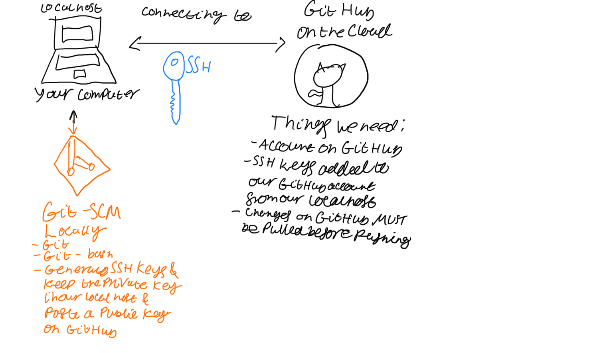

# Git overview

# Generating SSH keys
1. Download [Git](https://git-scm.com)
    - Note that on a mac you can just use `brew install git` to get the latest version through [homebrew](https://brew.sh)
2. Now you've got to generate an SSH key
    - Open the terminal and create a new folder called `.ssh`. Use `mkdir` for that
    - You may use this command: `ssh-keygen -t ed25519 -C "your_email@example.com"` to generate an SSH key
        - I recommend reading [this](https://docs.github.com/en/github/authenticating-to-github/connecting-to-github-with-ssh/generating-a-new-ssh-key-and-adding-it-to-the-ssh-agent#generating-a-new-ssh-key) for more information on the different types of keys you can generate
    - Follow the on screen instructions but you may just press <kbd>Enter</kbd> to set using default settings
    - Find the `.pub` public key and use the `cat` command to display the key on screen
    - Navigate to [this page](https://github.com/settings/ssh/new) and enter in the public key
# Now how to do the repository setup!
- `git init` initialises new repo on localhost
- `git status` to check what was added to be sent to GitHub
- `git add` adds all files/folders from the current location
- `git commit -m "first commit"` -m is to put any logical message
- `git branch -M main` To change branch from `master` to `main`
- `git remote add origin git@github.com:[user]/[repo].git` # connects localhost to GitHub repo
- `git push -u origin main` pushes the code upstream from localhost to GitHub